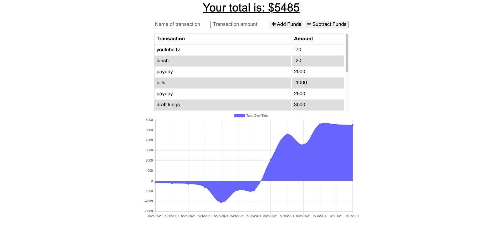

# Budget-Tracker
OSU wk 18 HW

## Description

An MVC app that allows users to login or sign up to create new, update or delete existing, and comment on other user's blogs!

## Technologies Used

* Javascript
* NodeJS
* npm
* express
* Heroku to deploy live app

## Table of Contents

- [Budget-Tracker](#budget-tracker)
  - [Description](#description)
  - [Technologies Used](#technologies-used)
  - [Table of Contents](#table-of-contents)
  - [Screenshot](#screenshot)
  - [Deployment](#deployment)
  - [Installation](#installation)
  - [Contribute](#contribute)
  - [Questions](#questions)

## Screenshot

## Deployment

[Heroku Deployment](https://protected-stream-94143.herokuapp.com/)

## Installation

Using the terminal, clone the repository to your local device using SSH or HTTPS. Once cloned, open repository in a text editor to make changes.

## Contribute

Please refer to [Contributor Covenant](https://www.contributor-covenant.org/version/2/0/code_of_conduct/) for contribution guidelines

## Questions

Created by: [Youngin9210](https://github.com/Youngin9210)

For any further information or questions please contact me at [kyleyoung.9210@gmail.com](mailto:kyleyoung.9210@gmail.com)